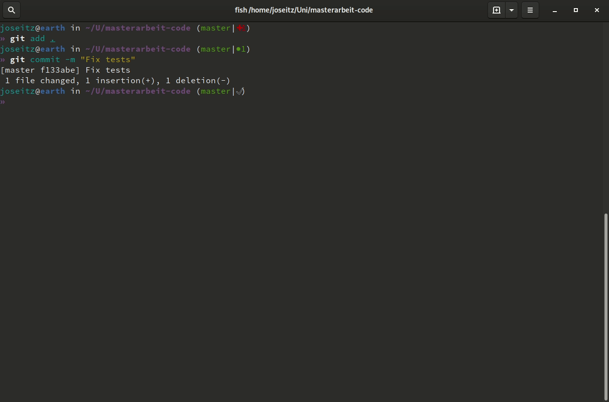

# Jarvis CD

Jarvis CD is a lightweight Build Server/Continuous Delivery tool for the pedantic idealist. It's going to be:

* Really easy to set up
* Embracing pipelines-as-code
* Run as a Git pre-receive hook
* Using Pre-Tested Commits by default
* Be secure by default
* Built on Docker. Pipelines run isolated by default.

This is a work in progress and not intended for production use.

## How it works

Git push something to your Repo in order to trigger a build. If the build fails, your revision will be rejected by the server by default.

## Usage

At the moment a Jarvis build is made up of four parts:

- the [jarvis executable](jarvis)
- a  [Dockerfile](Dockerfile)
- a [Jarvisfile](Jarvisfile)
- a [post-receive hook](post-receive.hook) for your Git Server

#### jarvis executable

Jarvis comes bundled with a Python runtime. All you need is a server with a halfway recent glibc (2.23 and above) and Docker.

#### Dockerfile

Used to build the environment for your build to execute in. You probably already have this. Put things that don't change often here, as it will only be rebuilt when the Dockerfile changes. 
The files from your Git Repo will be mounted at `/jarvis/` in the container so you will need to add a `VOLUME /jarvis/` to your Dockerfile.

#### Jarvisfile

This defines your build stages and the command to invoke at each stage. 

#### post-receive hook

This is the real magic of Jarvis, put it into your Git Server's hook directory (e.g. [the hooks/repo-specific directory in gitolite](https://gitolite.com/gitolite/non-core.html)) and it'll turn into a build server.

## Development

Install pipenv to create manage a virtualenv:

    pip install pipenv
    pipenv install --dev

Tests are run with

    pytest 

## TODO list of nice-to-add features

- [ ] secure secret storage
- [ ] deploy support
- [ ] more configuration options
- [ ] limit parallel builds 
- [ ] create a decent CLI
- [ ] automate release process 
